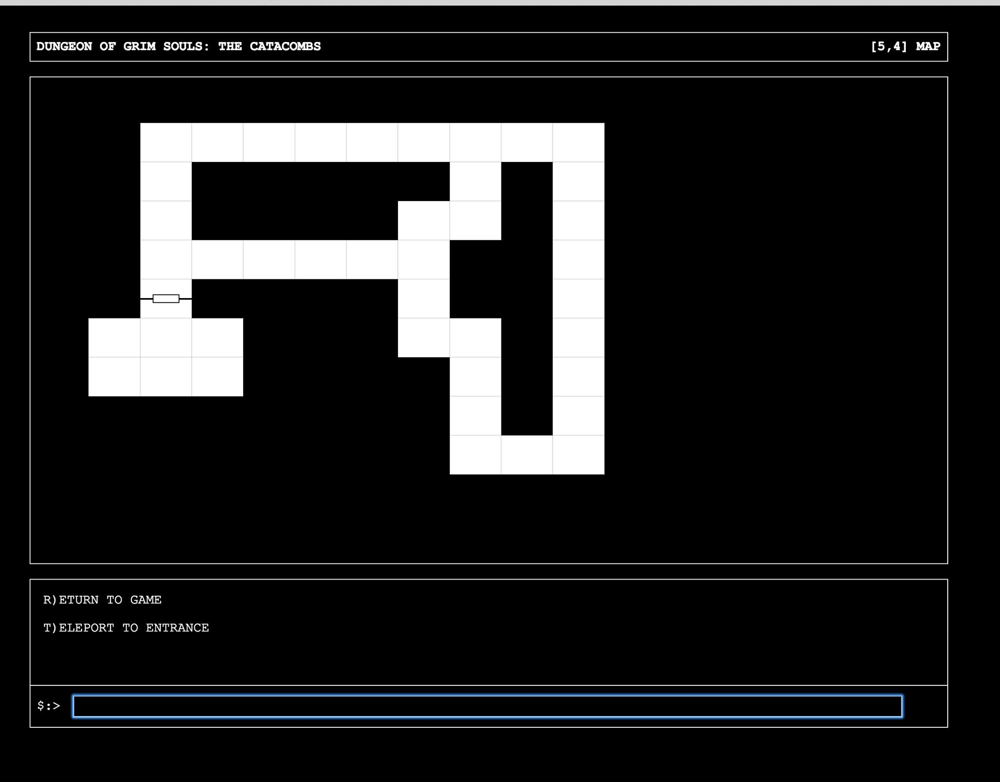

# Triskelion

## Synopsis

This is a D&D based Maze Crawler, RPG, Text-Based Adventure a'la Wizardry and Ultima.

### The Maze

### The Map

### A Character sheet

## Installation

Once cloned, you should do standard npm stuff. `npm install` is your first step. Then `grunt connect` to begin the app,
listening on localhost:8000 (this is using the grunt developer server).

